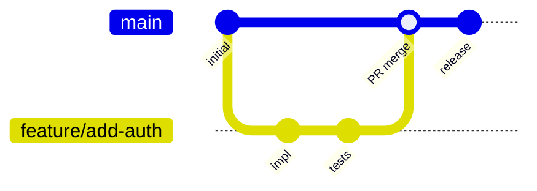
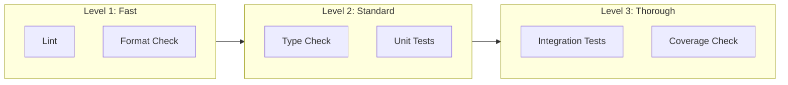

# SDLC Baseline

_Last updated: 2025-12-14_

This document defines the baseline Software Development Lifecycle practices for Project Atlas.

## Overview

The SDLC baseline establishes minimum standards for:
- Version control and branching
- Code review and pull requests
- Continuous integration gates
- Release and deployment patterns

## Branching Strategy

### Model: GitHub Flow (simplified)



### Rules

| Rule | Description |
|------|-------------|
| Main is protected | No direct pushes to `main` |
| Feature branches | All work in `feature/<short-description>` |
| Bugfix branches | Use `fix/<issue-id>-<description>` |
| Short-lived branches | Merge within 1 week; rebase if stale |
| Squash on merge | Clean history on main branch |

### Branch Naming Convention

```
<type>/<issue-id>-<short-description>

Types:
- feature/  : New functionality
- fix/      : Bug fixes
- docs/     : Documentation only
- refactor/ : Code restructuring
- test/     : Test additions/fixes
- chore/    : Build, config, tooling

Examples:
- feature/ATLAS-42-add-plugin-loader
- fix/ATLAS-99-memory-leak-in-parser
- docs/improve-readme
```

---

## Pull Request Requirements

### PR Template

Every PR must include:

```markdown
## Summary
<!-- What does this PR do? -->

## Related Issues
<!-- Link to Linear/GitHub issues -->
Closes ATLAS-XXX

## Changes
- [ ] Change 1
- [ ] Change 2

## Testing
<!-- How was this tested? -->
- [ ] Unit tests pass
- [ ] Manual testing completed

## Checklist
- [ ] Code follows project style guide
- [ ] Self-review completed
- [ ] Tests added/updated
- [ ] Documentation updated (if applicable)
```

### Review Requirements

| Repository Type | Approvals Required | Review Scope |
|-----------------|-------------------|--------------|
| Core platform | 1 (2 for breaking changes) | Full review |
| Module/plugin | 1 | Focused review |
| Documentation | 1 (can be self-approved) | Clarity check |

### Merge Criteria

A PR can be merged when:
1. All CI checks pass
2. Required approvals obtained
3. No unresolved review comments
4. Branch is up-to-date with main (or rebased)

---

## Continuous Integration Gates

### Gate Levels



### Required Gates (All PRs)

| Gate | Tool | Command | Threshold |
|------|------|---------|-----------|
| Linting | ruff | `ruff check .` | 0 errors |
| Formatting | ruff | `ruff format --check .` | 0 diff |
| Type checking | mypy | `mypy .` | 0 errors |
| Unit tests | pytest | `pytest tests/` | 100% pass |

### Recommended Gates (Main Branch)

| Gate | Tool | Command | Threshold |
|------|------|---------|-----------|
| Coverage | pytest-cov | `pytest --cov` | 80% minimum |
| Integration | pytest | `pytest tests/integration/` | 100% pass |
| Security | bandit (future) | `bandit -r src/` | 0 high severity |

### CI Pipeline Structure

```yaml
# Conceptual structure (actual implementation in Phase 02)
stages:
  - lint      # Fast feedback (< 30s)
  - test      # Standard checks (< 5 min)
  - build     # Artifact creation (< 10 min)
  - deploy    # Only on main (future)
```

---

## Code Quality Standards

### Style Guide

- **Python**: Follow PEP 8, enforced by ruff
- **TypeScript**: ESLint + Prettier (frontend)
- **Line length**: 88 characters (Black default)
- **Imports**: Sorted by isort rules (ruff handles this)

### Documentation Requirements

| Item | Documentation |
|------|--------------|
| Public functions | Docstring with Args, Returns, Raises |
| Classes | Docstring with purpose and usage |
| Modules | Module-level docstring |
| Complex logic | Inline comments explaining "why" |
| ADRs | Required for architectural decisions |

### Type Hints

All Python code must include type hints:

```python
def process_data(items: list[str], limit: int = 10) -> dict[str, int]:
    """Process items and return frequency counts."""
    ...
```

---

## Release Strategy

### Versioning: Semantic Versioning

```
MAJOR.MINOR.PATCH

- MAJOR: Breaking changes
- MINOR: New features, backward compatible
- PATCH: Bug fixes, backward compatible
```

### Release Cadence

| Phase | Release Type | Frequency |
|-------|-------------|-----------|
| Phase 00-02 | Internal/dev only | No formal releases |
| Phase 03+ | Alpha releases | End of each sprint |
| Post Phase 05 | Stable releases | Monthly or as needed |

### Release Checklist

- [ ] All CI checks pass on main
- [ ] CHANGELOG.md updated
- [ ] Version bumped in relevant files
- [ ] Git tag created (`v1.2.3`)
- [ ] Release notes drafted
- [ ] Artifacts built and tested

---

## Environment Parity

### Principle: Dev = CI = Prod

| Environment | Configuration | Purpose |
|-------------|--------------|---------|
| Local (Docker) | `docker-compose.yml` | Development |
| Local (Native) | `.venv` + `requirements.txt` | Quick iteration |
| CI | Docker-based | Automated testing |
| Staging | Container + infra (future) | Pre-production validation |
| Production | Container + infra (future) | Live system |

### Environment Variables

- Use `.env` files for local configuration
- Never commit secrets
- Document all required env vars in `.env.example`

---

## Incident Response (Placeholder)

To be expanded in Phase 05. Current baseline:

1. If something breaks, document in `OPEN_THREADS.md`
2. Create a Linear issue with `priority: urgent`
3. Fix forward (patch) rather than rollback when possible
4. Document root cause in `WORK_LOG.md`

---

## References

### Tier A (Peer-reviewed)
- Forsgren, N., et al. (2018). *Accelerate*. [DORA metrics, CI/CD practices]

### Tier B (Standards)
- Conventional Commits: https://www.conventionalcommits.org/
- Semantic Versioning: https://semver.org/
- PEP 8: https://peps.python.org/pep-0008/

### Tier C (Vendor Documentation)
- GitHub Flow: https://docs.github.com/en/get-started/quickstart/github-flow
- ruff: https://docs.astral.sh/ruff/

---

_Created: 2025-12-14_

