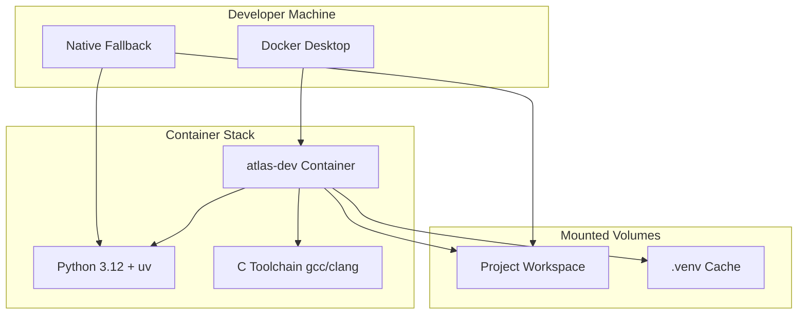

# Design Doc: Development Environment

## Title
Project Atlas Standard Development Environment

## Status
Draft

## Problem statement

Developers need a reproducible, consistent environment to work on Project Atlas components. Without standardization:
- Onboarding takes hours/days instead of minutes
- "Works on my machine" bugs waste debugging time
- Dependency conflicts between projects cause friction
- CI/CD environments diverge from local development

## Context

### Users / stakeholders
- Primary: Solo developer (project lead)
- Future: Team members onboarding to the project

### System boundaries
- Development machine: macOS (darwin 25.1.0)
- Target deployment: Container-first, on-prem/intranet
- Languages: Python (primary backend), C (compute-heavy), TypeScript/Next.js (frontend)

### Constraints
- On-prem preference: minimize cloud dependencies
- Must work with existing tooling: uv (Python), ruff (linting), pytest (testing)
- Container-first but with native fallback for machines without Docker
- Python version: latest stable (3.12+)

## Goals / non-goals

### Goals
- One-command environment setup for new contributors
- Reproducible builds across dev machines and CI
- Clear separation of Python backend and Node.js frontend concerns
- Support for C library compilation and Python bindings

### Non-goals
- Production deployment configuration (Phase 05)
- Multi-cloud portability (on-prem priority)
- GPU/ML-specific environment (Phase 04)

## Proposed design

### Architecture overview

### Key components

#### 1. Docker Development Container
- Base image: `python:3.12-slim-bookworm`
- Includes: Python, uv, ruff, C toolchain (gcc, make)
- Mounts workspace for live editing
- Caches `.venv` for faster rebuilds

#### 2. Python Environment (uv-managed)
- Version pinned in `.python-version`
- Dependencies in `requirements.txt` (locked versions)
- Virtual environment in `.venv/` (gitignored)
- Managed by `uv` for fast, reproducible installs

#### 3. Native Fallback
- For machines without Docker or for quick iterations
- Same `uv` + `requirements.txt` workflow
- Documented in runbook with platform-specific notes

### Data model / APIs

Not applicable for dev environment design.

### Operational concerns

#### Observability
- Container logs available via `docker-compose logs`
- Python logging configured for development verbosity

#### Failure modes
- Docker not installed: fallback to native Python
- Port conflicts: configurable port mapping in docker-compose
- Dependency resolution failure: uv provides clear error messages

#### Rollout / rollback
- Environment changes versioned in git
- Previous environment recoverable via git checkout

#### Capacity/performance considerations
- Container startup: < 30 seconds
- Full dependency install: < 2 minutes (with caching)
- Minimal disk footprint: ~500MB for base container

## Alternatives considered

### Alternative A: Devcontainer (VS Code specific)
- Pros: Deep IDE integration, automatic environment activation
- Cons: Locks into VS Code; not IDE-agnostic
- Decision: Defer; standard Dockerfile is more portable

### Alternative B: Nix / Nixpkgs
- Pros: Highly reproducible, cross-platform
- Cons: Steep learning curve, complexity overhead for solo project
- Decision: Reject for Phase 00; reconsider if team grows

### Alternative C: Conda
- Pros: Good for data science, handles C dependencies
- Cons: Slower than uv, heavier weight, mixing with pip is problematic
- Decision: Reject; uv is faster and aligns with modern Python practices

## Tradeoffs

| Decision | Benefit | Cost |
|----------|---------|------|
| Container-first | Reproducibility, isolation | Requires Docker installation |
| uv over pip/poetry | Speed, modern resolver | Newer tool, less ecosystem familiarity |
| Slim base image | Smaller size, faster pulls | May need to add packages manually |
| Native fallback | Flexibility | Two paths to maintain |

## Risks

| Risk | Likelihood | Impact | Mitigation |
|------|------------|--------|------------|
| Docker unavailable on target machine | Medium | High | Document native fallback |
| uv breaking changes | Low | Medium | Pin uv version in container |
| C toolchain compatibility | Low | Medium | Use standard gcc, test on CI |

## Open questions

- Q: Should we use multi-stage builds for smaller production images?
  - A: Defer to Phase 05 (production readiness)
  
- Q: How to handle secrets/credentials in dev environment?
  - A: Use `.env` file (gitignored), document in runbook

## Acceptance criteria

- [ ] `docker-compose up` builds and runs successfully
- [ ] `uv pip install -r requirements.txt` completes without errors
- [ ] `ruff check .` runs successfully inside container
- [ ] `pytest` (when tests exist) runs successfully
- [ ] Native fallback documented and tested on macOS

## References

### Tier A (Peer-reviewed)
- Humble, J., & Farley, D. (2010). *Continuous Delivery*. Addison-Wesley.

### Tier B (Standards/Specifications)
- Docker Best Practices: https://docs.docker.com/develop/develop-images/dockerfile_best-practices/
- Python Packaging User Guide: https://packaging.python.org/

### Tier C (Vendor Documentation)
- uv documentation: https://github.com/astral-sh/uv
- ruff documentation: https://docs.astral.sh/ruff/

---

_Created: 2025-12-14_

