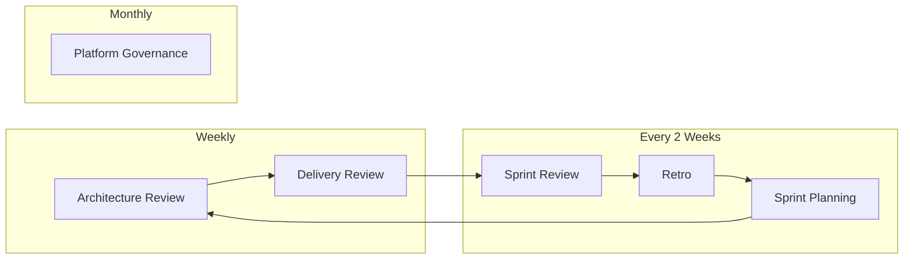

# Engineering Cadence

_Last updated: 2025-12-14_

This document defines the meeting rhythm and artifact expectations for Project Atlas.

## Cadence Overview

## Weekly Meetings

### Architecture Review (60-90 min)

**Purpose**: Review design decisions, validate tradeoffs, ensure alignment across modules.

**Frequency**: Weekly

**Attendees**: Project lead, relevant domain experts (when available)

**Inputs**:
- Design docs in review
- ADR proposals
- Open architecture questions from `OPEN_THREADS.md`

**Outputs**:
- Design doc status updates (Draft → In Review → Approved)
- New/updated ADRs
- Updated `DECISION_JOURNAL.md`

**Agenda Template**:
1. (5 min) Review agenda, any urgent items
2. (30 min) Design doc deep-dive (one per week)
3. (15 min) ADR review and decisions
4. (10 min) Cross-cutting concerns (dependencies, integration points)
5. (5 min) Action items, owners, due dates

---

### Delivery Review (30-60 min)

**Purpose**: Track delivery health, identify blockers, measure progress.

**Frequency**: Weekly

**Attendees**: Project lead

**Inputs**:
- Linear board state
- `PROJECT_STATE.md`
- CI/CD pipeline status

**Outputs**:
- Updated `PROJECT_STATE.md` (next 3 tasks)
- Blockers logged to `OPEN_THREADS.md`
- Metrics snapshot (when available)

**Agenda Template**:
1. (5 min) What shipped since last review?
2. (10 min) What's in progress? Any blockers?
3. (10 min) Metrics review (lead time, WIP, failures)
4. (5 min) Priority adjustments for next week

---

## Sprint Meetings (Every 2 Weeks)

### Sprint Planning (60 min)

**Purpose**: Define scope for the upcoming sprint, commit to deliverables.

**Timing**: First day of sprint (Monday)

**Inputs**:
- Phase deliverables list
- Previous sprint retro actions
- `PROJECT_STATE.md` next tasks

**Outputs**:
- Completed sprint brief (using template)
- Linear issues created
- Clear acceptance criteria

**Agenda Template**:
1. (10 min) Review phase goals and progress
2. (20 min) Select and scope sprint deliverables
3. (20 min) Break down into tasks, estimate effort
4. (10 min) Identify risks, dependencies, unknowns

---

### Sprint Review / Demo (60 min)

**Purpose**: Demonstrate completed work, gather feedback, validate acceptance criteria.

**Timing**: Last day of sprint (Friday)

**Inputs**:
- Sprint brief with acceptance criteria
- Completed deliverables

**Outputs**:
- Acceptance criteria sign-off
- Feedback documented
- Incomplete items triaged for next sprint

**Agenda Template**:
1. (5 min) Sprint goal recap
2. (30 min) Demo completed deliverables
3. (15 min) Acceptance criteria walkthrough
4. (10 min) Discuss incomplete items, carry-over decision

---

### Retrospective (45 min)

**Purpose**: Continuous improvement—what worked, what didn't, what to change.

**Timing**: After sprint review

**Inputs**:
- Sprint brief
- Team observations

**Outputs**:
- Completed retro document (using template)
- 1-3 specific improvement actions for next sprint

**Agenda Template**:
1. (5 min) Set the stage (prime directive)
2. (15 min) What worked well?
3. (15 min) What didn't work / what to improve?
4. (10 min) Decide on actions (max 3, with owners)

---

## Monthly Meetings

### Platform Governance (60-90 min)

**Purpose**: Review module contracts, plan deprecations, align on versioning strategy.

**Frequency**: Monthly (or as needed)

**Attendees**: Project lead, module owners (when applicable)

**Inputs**:
- Module interface specifications
- Breaking change proposals
- Dependency update requests

**Outputs**:
- Module contract updates
- Deprecation timeline decisions
- Version bump decisions

**Agenda Template**:
1. (10 min) Review current module inventory
2. (20 min) Breaking change proposals
3. (20 min) Deprecation status and timelines
4. (10 min) Dependency updates review
5. (10 min) Action items

---

## Artifact Requirements

### Principle: No meeting without a doc

Every meeting must:
1. Have an agenda (can be simple bullet points)
2. Produce at least one artifact (decision, update, action item)
3. Update relevant tracking documents

### Document Ownership

| Document | Owner | Update Frequency |
|----------|-------|------------------|
| `PROJECT_STATE.md` | Project Lead | At least weekly |
| `DECISION_JOURNAL.md` | Project Lead | After each architecture review |
| `WORK_LOG.md` | Project Lead | Daily or weekly |
| Sprint Brief | Sprint Owner | Once per sprint |
| Retro | Sprint Owner | Once per sprint |
| ADRs | Decision Author | As decisions are made |

---

## Solo Developer Adaptation

When working solo, these "meetings" become focused work blocks:

| Meeting | Solo Adaptation |
|---------|-----------------|
| Architecture Review | 30-min design doc review session |
| Delivery Review | 15-min PROJECT_STATE.md update |
| Sprint Planning | 30-min sprint brief creation |
| Sprint Review | Self-review against acceptance criteria |
| Retro | 15-min reflection, update retro doc |

The key is maintaining the **artifacts**, not the ceremony.

---

## References

- [Meeting Cadence Template](../../../02_Templates/meeting_cadence.md)
- [Sprint Brief Template](../../../02_Templates/sprint_brief.md)
- [Retro Template](../../../02_Templates/retro.md)

---

_Created: 2025-12-14_

